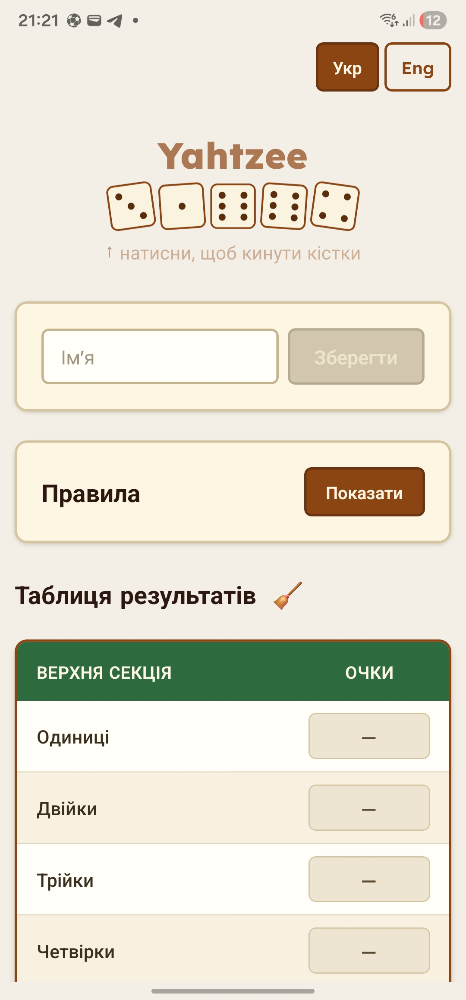
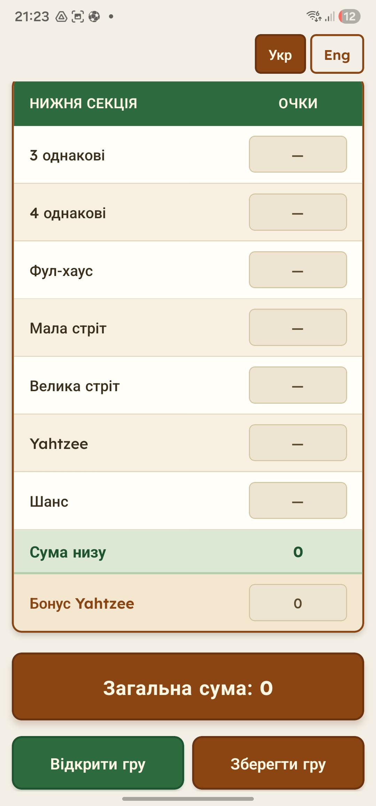
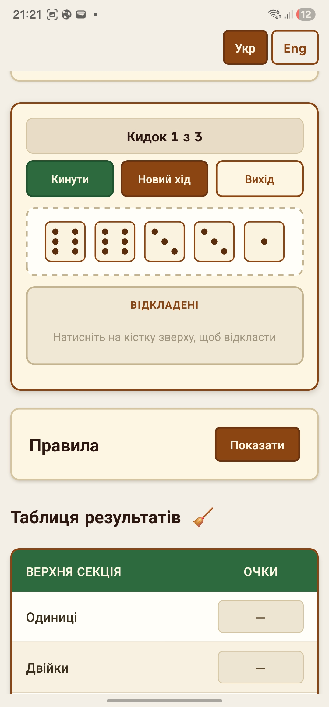
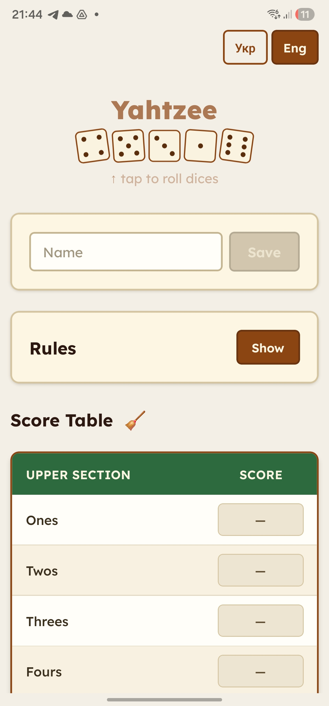
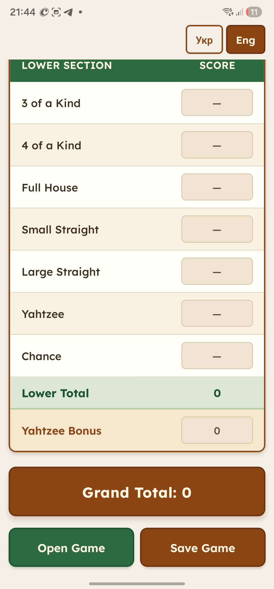
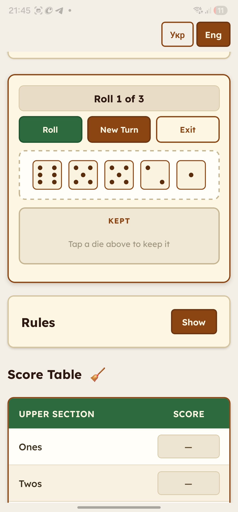

# Yahtzee Mobile

A React Native / Expo scorekeeper for playing Yahtzee with real dice — built together with my sons **Pavlo** and **Mykhailo**. Many thanks, guys, for the ideas, testing, and development spirit that shaped this app!

> **Tip:** Tap the app logo to enter **mini dice game mode** and roll dice right inside the app.

---

## How to Play

Yahtzee is a dice game for 2 or more players. Each turn you roll five dice up to three times, trying to score points in 13 categories. The player with the highest grand total wins.

**On your turn:**
1. Roll all five dice.
2. Keep any dice you like — tap them to move to the "kept" zone.
3. Roll the remaining dice again (up to 2 more times).
4. After your final roll, tap a category in the score table to record your score. Each category can only be used once.

### Scoring categories

| Category | Points |
|---|---|
| Ones … Sixes | Sum of that face value |
| 3 of a Kind | Sum of all dice |
| 4 of a Kind | Sum of all dice |
| Full House | 25 |
| Small Straight (4 in a row) | 30 |
| Large Straight (5 in a row) | 40 |
| Yahtzee (all 5 the same) | 50 |
| Chance | Sum of all dice |

**Upper section bonus:** if your ones–sixes total is 63 or more, you get +35 bonus points.

**Yahtzee bonus:** each extra Yahtzee after the first scores +100, but only if you originally scored 50 in the Yahtzee box (not 0).

If no category fits your roll, you must enter 0 somewhere — choose wisely!

---

## Screenshots

  

  

---

## Features

- Score table  with automatic totals and bonuses
- Upper section bonus, Yahtzee bonus picker (0–1000 in steps of 100)
- Save / open game state as a JSON file (share or restore any session)
- 24-hour auto-save via AsyncStorage — pick up where you left off
- Built-in dice roller with roll animation and kept/free zones (up to 3 rolls per turn)
- Ukrainian and English UI (toggle in the top-right corner)
- Lexend font for improved readability

## Tech Stack

| Layer | Choice |
|---|---|
| Framework | React Native 0.81 + Expo SDK 54 |
| Language | TypeScript 5.9 |
| Persistence | AsyncStorage (24 h sliding expiry) |
| File I/O | expo-sharing, expo-document-picker, expo-file-system/legacy |
| Graphics | react-native-svg |
| Font | @expo-google-fonts/lexend |
| Build | EAS Build |

## Getting Started

### Prerequisites

- Node.js 18+
- [Expo Go](https://expo.dev/go) on your Android device

### Run locally

```bash
npm install
npx expo start --clear
```

Scan the QR code with Expo Go to open the app on your device.

### Run on Android emulator

```bash
npm run android
```

### Run tests

```bash
npm test
```

Tests cover scoring logic, game-file validation, and i18n key parity between Ukrainian and English.

## Building for Production

This project uses [EAS Build](https://docs.expo.dev/build/introduction/).

```bash
npx eas build --platform android
```

## Releases

Pre-built Android APKs are available in `RELEASE/Android/` and can be sideloaded directly without the Play Store.

## Languages

The app ships with two UI languages:

| Code | Language | Notes |
|---|---|---|
| `uk` | Ukrainian | Default language |
| `en` | English | |

Switch languages using the toggle in the top-right corner of the app. All UI strings — category names, labels, buttons, and rules — are fully translated. The selected language is persisted between sessions.

## License

GPL
